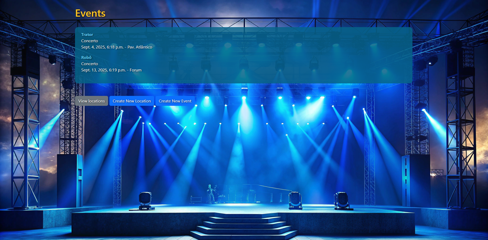

# Django Mini Project - Event Management



This project is a simple web application for managing events, locations, and artists, built with Django.

## Folder and File Structure

```
passal_project/
│
├── events_site/                # Django project main directory
│   ├── events_site/            # Global project configuration (settings, urls, wsgi)
│   │   ├── __init__.py
│   │   ├── asgi.py
│   │   ├── settings.py         # Project settings (databases, apps, etc)
│   │   ├── urls.py             # Global project URLs
│   │   └── wsgi.py
│   │
│   ├── events/                 # Main app: events, locations and artists management
│   │   ├── migrations/         # Database migrations
│   │   ├── static/             # Static files (CSS, images)
│   │   │   └── events/
│   │   │       └── page_style.css   # Project custom styles
│   │   ├── templates/          # HTML Templates
│   │   │   └── events/
│   │   │       ├── list.html                   # Main page (events list)
│   │   │       ├── locations/
│   │   │       │   ├── location_list.html      # Locations list
│   │   │       │   └── create_location.html    # Location creation form
│   │   │       └── events/
│   │   │           └── create_event.html       # Event creation form
│   │   ├── __init__.py
│   │   ├── admin.py             # Django admin model registration
│   │   ├── apps.py
│   │   ├── forms.py             # Django forms for events/locations
│   │   ├── models.py            # Database models (Event, Location, Artist)
│   │   ├── tests.py
│   │   ├── urls.py              # App-specific URLs
│   │   └── views.py             # Functions/views that handle requests and return pages
│   │
│   └── manage.py                # Script for Django commands (runserver, migrate, etc)
│
└── db.sqlite3                   # SQLite database (ignored in .gitignore)
```

## Purpose of Each Component

- **events_site/settings.py**: Global Django configuration (installed apps, database, static files, etc).
- **events_site/urls.py**: Links global project URLs to apps.
- **events/**: Main app, containing all logic for events, locations, and artists.
- **events/models.py**: Defines database tables (models).
- **events/forms.py**: Defines forms used in creation/editing pages.
- **events/views.py**: Functions that receive HTTP requests, process data, and return HTML pages.
- **events/urls.py**: Links app-specific URLs to views.
- **events/templates/**: HTML files for each page.
- **events/static/**: Static files (CSS, background images, etc).
- **db.sqlite3**: Local database (can be ignored in repository).

## How to Use

1. Install dependencies (`pip install -r requirements.txt`).
2. Run migrations (`python manage.py migrate`).
3. Start the server (`python manage.py runserver`).
4. Access [http://localhost:8000/](http://localhost:8000/) to use the application.


# Mini Projeto Django - Gestão de Eventos

Este projeto é uma aplicação web simples para gerir eventos, localizações e artistas, construída com Django.

## Estrutura das Pastas e Ficheiros

```
passal_project/
│
├── events_site/                # Diretório principal do projeto Django
│   ├── events_site/            # Configuração global do projeto (settings, urls, wsgi)
│   │   ├── __init__.py
│   │   ├── asgi.py
│   │   ├── settings.py         # Configurações do projeto (bases de dados, apps, etc)
│   │   ├── urls.py             # URLs globais do projeto
│   │   └── wsgi.py
│   │
│   ├── events/                 # App principal: gestão de eventos, localizações e artistas
│   │   ├── migrations/         # Migrações da base de dados
│   │   ├── static/             # Ficheiros estáticos (CSS, imagens)
│   │   │   └── events/
│   │   │       └── page_style.css   # Estilos personalizados do projeto
│   │   ├── templates/          # Templates HTML
│   │   │   └── events/
│   │   │       ├── list.html                   # Página principal (lista de eventos)
│   │   │       ├── locations/
│   │   │       │   ├── location_list.html      # Lista de localizações
│   │   │       │   └── create_location.html    # Formulário para criar localização
│   │   │       └── events/
│   │   │           └── create_event.html       # Formulário para criar evento
│   │   ├── __init__.py
│   │   ├── admin.py             # Registo dos modelos no admin Django
│   │   ├── apps.py
│   │   ├── forms.py             # Formulários Django para eventos/localizações
│   │   ├── models.py            # Modelos da base de dados (Event, Location, Artist)
│   │   ├── tests.py
│   │   ├── urls.py              # URLs específicas do app events
│   │   └── views.py             # Funções/views que tratam os pedidos e devolvem páginas
│   │
│   └── manage.py                # Script para comandos Django (runserver, migrate, etc)
│
└── db.sqlite3                   # Base de dados SQLite (ignorada no .gitignore)
```

## Para que serve cada parte

- **events_site/settings.py**: Configuração global do Django (apps instaladas, base de dados, ficheiros estáticos, etc).
- **events_site/urls.py**: Liga as URLs globais do projeto aos apps.
- **events/**: App principal, com toda a lógica de eventos, localizações e artistas.
- **events/models.py**: Define as tabelas (modelos) da base de dados.
- **events/forms.py**: Define os formulários usados nas páginas de criação/edição.
- **events/views.py**: Funções que recebem pedidos HTTP, processam dados e devolvem páginas HTML.
- **events/urls.py**: Liga URLs específicas do app às views.
- **events/templates/**: Ficheiros HTML para cada página.
- **events/static/**: Ficheiros estáticos (CSS, imagens de fundo, etc).
- **db.sqlite3**: Base de dados local (pode ser ignorada no repositório).

## Como usar

1. Instalar as dependências (`pip install -r requirements.txt`).
2. Fazer as migrações (`python manage.py migrate`).
3. Iniciar o servidor (`python manage.py runserver`).
4. Aceder a [http://localhost:8000/](http://localhost:8000/) para usar a aplicação.


